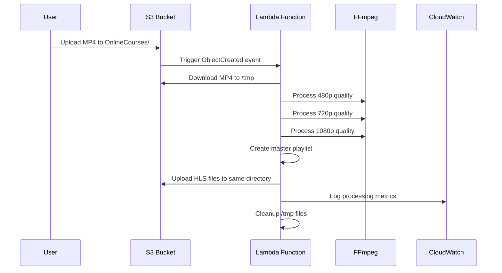

# 🤖 Cursor IDE & Claude AI Assistant Documentation

This document provides comprehensive guidance for using **Cursor IDE** and **Claude AI Assistant** with the MP4 to HLS video processing project. It includes development workflows, code explanations, troubleshooting techniques, and best practices for AI-assisted development.

## 📋 Table of Contents

1. [🎯 Project Overview for AI Assistants](#-project-overview-for-ai-assistants)
2. [🏗️ Architecture Deep Dive](#-architecture-deep-dive)
3. [🔄 Development Workflow with Cursor](#-development-workflow-with-cursor)
4. [🤖 Claude AI Assistant Usage Patterns](#-claude-ai-assistant-usage-patterns)
5. [🐛 Debugging with AI Assistance](#-debugging-with-ai-assistance)
6. [📊 Monitoring and Observability](#-monitoring-and-observability)
7. [🚀 Deployment and CI/CD](#-deployment-and-cicd)
8. [💡 Common AI-Assisted Tasks](#-common-ai-assisted-tasks)
9. [🔍 Code Analysis and Review](#-code-analysis-and-review)
10. [⚠️ Troubleshooting Guide](#-troubleshooting-guide)

## 🎯 Project Overview for AI Assistants

### What This Project Does

This is a **serverless video processing pipeline** that automatically converts MP4 videos to HLS (HTTP Live Streaming) format when uploaded to an AWS S3 bucket. The system:

1. **Triggers automatically** when `.mp4` files are uploaded to `s3://pba-users-bucket/OnlineCourses/`
2. **Converts video to 3 quality tiers**: 480p, 720p, and 1080p
3. **Creates adaptive streaming playlists** for seamless video playback
4. **Preserves original files** alongside generated HLS content
5. **Uses pure FFmpeg** processing in AWS Lambda (no MediaConvert)

### Key Components

```
🏗️ Infrastructure (CDK)
├── 🚀 Lambda Function (Node.js 20.x, 3008MB, 15min timeout)
├── 🔔 S3 Event Triggers (.mp4 files in OnlineCourses/ prefix)
├── 🔐 IAM Roles (least privilege access)
└── 📊 CloudWatch Monitoring (dashboards, alarms, logs)

🎬 Processing Logic
├── 📥 Download MP4 from S3 to /tmp
├── 🔧 FFmpeg Processing (480p → 720p → 1080p)
├── 📋 Master Playlist Generation (.m3u8)
├── 📤 Upload HLS files to same S3 directory
└── 🧹 Cleanup temporary files
```

### Technology Stack

- **Infrastructure**: AWS CDK (TypeScript)
- **Runtime**: Node.js 20.x on AWS Lambda
- **Video Processing**: Static FFmpeg binary
- **Storage**: AWS S3 with event notifications
- **Monitoring**: CloudWatch Logs, Metrics, Dashboards
- **CI/CD**: GitHub Actions (optional)

## 🏗️ Architecture Deep Dive

### 🔄 Data Flow



### 📁 File Organization

```
Project Structure:
├── bin/app.ts              # CDK app entry point
├── lib/video-processor.ts  # CDK stack definition
├── src/video-processing-handler.ts  # Lambda function code
├── scripts/                # Manual processing scripts
│   ├── batch-convert-keep-structure.sh
│   ├── local-hls-convert.sh
│   └── fix-s3-cors.sh
├── package.json           # Node.js dependencies
├── tsconfig.json         # TypeScript configuration
├── cdk.json             # CDK settings
└── README.md           # Main documentation
```

### 🎚️ Quality Tier Specifications

| Tier  | Resolution | Video Bitrate | Audio Bitrate | CRF | Target Use Case             |
| ----- | ---------- | ------------- | ------------- | --- | --------------------------- |
| 480p  | 854x480    | 1000k         | 128k          | 23  | Mobile, low bandwidth       |
| 720p  | 1280x720   | 2500k         | 128k          | 21  | Desktop, standard quality   |
| 1080p | 1920x1080  | 5000k         | 192k          | 20  | High quality, fast internet |

## 🔄 Development Workflow with Cursor

### 🚀 Initial Setup

```bash
# Clone and setup
git clone <repository-url>
cd mp4-to-hls

# Install dependencies
npm install

# Cursor-specific: Enable TypeScript support
# Ensure .vscode/settings.json includes:
{
  "typescript.preferences.includePackageJsonAutoImports": "on",
  "typescript.suggest.autoImports": true,
  "aws-cdk.cdkVersion": "2.x"
}
```

### 🔧 Common Development Tasks

#### 1. **Modifying Video Quality Settings**

```typescript
// In src/video-processing-handler.ts
// Look for the VideoQuality interface and quality definitions:
const qualities = [
  {
    name: "480p",
    width: 854,
    height: 480,
    videoBitrate: "1000k",
    audioBitrate: "128k",
    bufferSize: "2000k",
    crf: 23,
  },
  {
    name: "720p",
    width: 1280,
    height: 720,
    videoBitrate: "2500k",
    audioBitrate: "128k",
    bufferSize: "5000k",
    crf: 21,
  },
  {
    name: "1080p",
    width: 1920,
    height: 1080,
    videoBitrate: "5000k",
    audioBitrate: "192k",
    bufferSize: "10000k",
    crf: 20,
  },
];
```

#### 2. **Adding New Quality Tiers**

Ask Claude: _"How do I add a 4K quality tier to this video processing system?"_

Expected response will include:

- Modifying the `VideoQuality` interface
- Adding 4K specifications to the qualities array
- Updating the master playlist generation
- Considering Lambda memory/timeout limitations

#### 3. **Changing S3 Bucket Configuration**

```typescript
// In bin/app.ts
const bucketName = "pba-users-bucket"; // Change this
const bucketPrefix = "OnlineCourses/"; // Change this
```

### 🧪 Testing Workflow

```bash
# Local TypeScript compilation
npm run build

# CDK syntax validation
npx cdk synth

# Deploy to dev environment
npx cdk deploy --context environment=development

# Test with sample video
aws s3 cp test-video.mp4 s3://pba-users-bucket/OnlineCourses/test/sample.mp4

# Monitor processing
aws logs tail /aws/lambda/VideoProcessingStack-VideoToHLS --follow
```

## 🤖 Claude AI Assistant Usage Patterns

### 📝 Effective Prompt Patterns

#### 1. **Code Analysis Requests**

```
"Analyze the FFmpeg command in the generateQualityHLS function.
What does each parameter do, and how would I optimize it for faster processing?"
```

#### 2. **Infrastructure Modification**

```
"I want to add an SNS notification when video processing completes.
Show me the CDK code changes needed and the Lambda function modifications."
```

#### 3. **Debugging Assistance**

```
"My Lambda function is timing out on large videos. Here's the CloudWatch log: [paste log].
What's the likely cause and how can I fix it?"
```

#### 4. **Performance Optimization**

```
"How can I optimize this video processing Lambda for cost and speed?
Current specs: 3008MB memory, 15min timeout, processing 1-hour videos."
```

### 🔍 Code Context for AI

When asking Claude about specific parts of the codebase, provide this context:

**For Lambda Function Issues:**

- File: `src/video-processing-handler.ts`
- Key functions: `handler()`, `convertMp4ToHls()`, `generateQualityHLS()`
- Dependencies: `@aws-sdk/client-s3`, `ffmpeg` binary

**For Infrastructure Issues:**

- File: `lib/video-processor.ts`
- Key components: Lambda function, S3 events, IAM roles
- Configuration: `bin/app.ts`

**For FFmpeg Issues:**

- Reference: `scripts/batch-convert-keep-structure.sh` (identical commands)
- Parameters: CRF, bitrates, segment duration, scaling filters

## 🐛 Debugging with AI Assistance

### 🚨 Common Error Patterns

#### 1. **Lambda Timeout Errors**

**Symptoms:** CloudWatch logs show timeout after 15 minutes
**AI Prompt:**

```
"My video processing Lambda times out on videos longer than X minutes.
Here's my FFmpeg configuration: [paste config].
How can I optimize processing speed or handle large files?"
```

**Expected Claude Response:**

- Reduce CRF values for faster encoding
- Lower resolution/bitrate for speed
- Split processing into multiple invocations
- Consider Step Functions for orchestration

#### 2. **S3 Permission Errors**

**Symptoms:** `AccessDenied` errors in CloudWatch
**AI Prompt:**

```
"Getting S3 AccessDenied errors in my Lambda. Here's my IAM policy: [paste policy].
The Lambda needs to read/write to pba-users-bucket/OnlineCourses/. What's wrong?"
```

#### 3. **FFmpeg Processing Errors**

**Symptoms:** FFmpeg exits with non-zero code
**AI Prompt:**

```
"FFmpeg command failing with error: [paste error].
Source video details: [format/codec].
What's the issue and how do I fix it?"
```

### 📊 Log Analysis with AI

**Prompt Pattern:**

```
"Analyze this CloudWatch log excerpt from my video processing Lambda:
[paste 20-50 lines of logs]

Tell me:
1. What stage of processing failed?
2. Likely root cause?
3. How to fix it?
4. How to prevent it?"
```

### 🔧 Performance Debugging

**Memory Usage Analysis:**

```bash
# Get memory usage metrics
aws logs filter-events \
  --log-group-name "/aws/lambda/VideoProcessingStack-VideoToHLS" \
  --filter-pattern "Max Memory Used"
```

**AI Analysis Prompt:**

```
"Here are my Lambda memory usage patterns: [paste metrics]
My function has 3008MB allocated.
Should I increase/decrease memory, and how will it affect cost/performance?"
```

## 📊 Monitoring and Observability

### 🎯 Key Metrics to Monitor

```typescript
// CloudWatch metrics created by the CDK stack
const keyMetrics = [
  "AWS/Lambda/Invocations", // Processing requests
  "AWS/Lambda/Duration", // Processing time
  "AWS/Lambda/Errors", // Failed conversions
  "AWS/Lambda/Throttles", // Concurrency limits
  "AWS/S3/BucketRequests", // Upload activity
];
```

### 📈 Dashboard Queries for AI Analysis

**AI Prompt for Performance Analysis:**

```
"Based on these CloudWatch metrics over the last 7 days:
- Average duration: 8.5 minutes
- Error rate: 2.3%
- Memory utilization: 85%
- Throttles: 0

How is my video processing pipeline performing?
What optimizations would you recommend?"
```

### 🔔 Alert Configuration

Ask Claude to help create intelligent alerts:

```
"Create CloudWatch alarms for my video processing Lambda that:
1. Alert if error rate > 5% over 10 minutes
2. Alert if duration > 12 minutes (80% of timeout)
3. Alert if memory usage > 95%
Show me the CDK code."
```

## 🚀 Deployment and CI/CD

### 🔄 GitHub Actions Integration

**AI Prompt for CI/CD Setup:**

```
"I want to set up GitHub Actions to automatically deploy my CDK stack
when I push to main branch.
Current stack name: VideoProcessingStack
Target AWS account: [account-id]
What secrets and workflow file do I need?"
```

### 🌟 Environment Management

```typescript
// Environment-specific configurations for AI assistance
const environments = {
  development: {
    bucketName: "pba-dev-bucket",
    enableMonitoring: false,
    logRetention: 3, // days
  },
  production: {
    bucketName: "pba-users-bucket",
    enableMonitoring: true,
    logRetention: 7, // days
  },
};
```

**AI Context for Environment Questions:**

```
"I have dev and prod environments with different bucket names.
How do I configure my CDK app to deploy to the right environment
based on a parameter or environment variable?"
```

## 💡 Common AI-Assisted Tasks

### 🎬 Video Processing Enhancements

#### 1. **Adding Subtitles/Captions**

**AI Prompt:**

```
"How do I modify my FFmpeg commands to extract and include subtitle tracks
in the HLS output? My current command is: [paste FFmpeg command]"
```

#### 2. **Custom Video Filters**

**AI Prompt:**

```
"I want to add a watermark to all processed videos.
Show me how to modify the FFmpeg command in generateQualityHLS()
to overlay a PNG image at bottom-right corner."
```

#### 3. **Audio-Only Processing**

**AI Prompt:**

```
"How do I extend this system to also process .mp3 files uploaded to S3,
converting them to HLS audio streams? Show me the code changes needed."
```

### 📊 Analytics and Reporting

**AI Prompt for Analytics:**

```
"I want to track video processing statistics:
- Total videos processed per day
- Average processing time by video duration
- Quality tier popularity
- Error rates by file type

Show me how to add custom CloudWatch metrics to my Lambda function."
```

### 🔧 Infrastructure Improvements

#### 1. **Cost Optimization**

**AI Prompt:**

```
"Analyze my video processing costs. I process 100 videos/month,
average 30 minutes each. Current setup: Lambda 3008MB, S3 storage.
How can I reduce costs while maintaining quality?"
```

#### 2. **Scalability Enhancements**

**AI Prompt:**

```
"My video processing sometimes hits Lambda concurrency limits.
How do I implement a queue-based system using SQS + multiple Lambdas
for better scalability?"
```

## 🔍 Code Analysis and Review

### 📝 Code Quality Prompts

**For Code Review:**

```
"Review this Lambda function for best practices: [paste code]
Check for:
1. Error handling completeness
2. Memory leaks or resource cleanup
3. Security vulnerabilities
4. Performance optimizations
5. AWS service best practices"
```

**For Refactoring:**

```
"This function is getting large (200+ lines).
How should I break it into smaller, more maintainable functions?
[paste function code]"
```

### 🏗️ Architecture Review

**System Design Analysis:**

```
"Evaluate this serverless video processing architecture:
- S3 trigger → Lambda → FFmpeg → S3
- Max 15min processing time
- 3008MB memory allocation

What are the limitations and how would you improve it for:
1. Processing 4+ hour videos
2. Higher concurrency (100+ simultaneous uploads)
3. Different output formats (not just HLS)"
```

## ⚠️ Troubleshooting Guide

### 🚨 Quick Diagnostic Commands

```bash
# Check Lambda function status
aws lambda get-function --function-name VideoProcessingStack-VideoToHLS

# View recent errors
aws logs filter-events \
  --log-group-name "/aws/lambda/VideoProcessingStack-VideoToHLS" \
  --filter-pattern "ERROR"

# Check S3 event configuration
aws s3api get-bucket-notification-configuration --bucket pba-users-bucket

# Test video upload
aws s3 cp test.mp4 s3://pba-users-bucket/OnlineCourses/test/test.mp4
```

### 🤖 AI-Powered Troubleshooting

#### Problem: Videos Not Processing

**Diagnostic Prompt:**

```
"Videos uploaded to s3://pba-users-bucket/OnlineCourses/ aren't triggering processing.
Here's my S3 event configuration: [paste config]
Here's my Lambda function details: [paste function info]
What could be wrong?"
```

#### Problem: Poor Quality Output

**Analysis Prompt:**

```
"My processed videos look pixelated/blurry compared to originals.
Current FFmpeg settings: CRF 23/21/20, bitrates 1000k/2500k/5000k
Input video specs: [resolution/bitrate/codec]
How do I improve quality without significantly increasing file size?"
```

#### Problem: High Processing Costs

**Cost Analysis Prompt:**

```
"My Lambda costs are higher than expected.
Processing 50 videos/month (avg 45min each) costs $X.
Memory: 3008MB, Duration avg: 12min
How can I optimize for cost?"
```

### 📋 Systematic Debugging Workflow

1. **Gather Context**

   - CloudWatch logs (last 24 hours)
   - Lambda function configuration
   - S3 event configuration
   - Sample problematic video details

2. **AI Analysis Prompt Template**

   ```
   "I'm experiencing [specific problem] with my video processing system.

   System details:
   - Lambda: [function name, memory, timeout]
   - S3 bucket: [name and prefix]
   - Processing: FFmpeg with [quality settings]

   Error/Issue:
   [paste relevant logs or describe problem]

   Recent changes:
   [any recent modifications]

   Please analyze and provide:
   1. Root cause analysis
   2. Step-by-step fix
   3. Prevention strategies
   4. Monitoring improvements"
   ```

3. **Implement Fix**

   - Apply suggested changes
   - Test with sample video
   - Monitor results

4. **Validate Solution**
   - Confirm fix resolves issue
   - Update documentation
   - Add monitoring/alerts to prevent recurrence

### 🔄 Continuous Improvement

**Monthly Review Prompt:**

```
"Based on these monthly metrics for my video processing system:
- Total processed: X videos
- Average duration: Y minutes
- Error rate: Z%
- Costs: $A
- Popular quality tiers: [distribution]

What improvements would you recommend for:
1. Performance optimization
2. Cost reduction
3. User experience enhancement
4. System reliability"
```

---

## 🎯 Quick Reference for AI Interactions

### 📋 Essential Context to Provide Claude

When asking questions about this project, always include:

1. **System Overview**: "This is a serverless MP4→HLS conversion system using AWS Lambda + FFmpeg"
2. **Current Issue**: Specific problem you're facing
3. **Relevant Code**: Paste the specific function/configuration having issues
4. **Error Messages**: Exact error messages from CloudWatch logs
5. **Environment**: Dev/prod environment details

### 🎬 Example AI Conversation Starters

- _"Explain how the S3 event triggers the Lambda function in this codebase"_
- _"How do I add a 4K quality tier to the existing processing pipeline?"_
- _"My Lambda is running out of memory - analyze this function for memory leaks"_
- _"Show me how to add SNS notifications when processing completes"_
- _"Optimize these FFmpeg settings for faster processing while maintaining quality"_

### 🔧 Code Snippets for Quick Reference

**Lambda Handler Structure:**

```typescript
export const handler = async (event: S3Event) => {
  // Process each uploaded video
  for (const record of event.Records) {
    const result = await convertMp4ToHls(bucket, key);
  }
};
```

**FFmpeg Command Pattern:**

```typescript
const command = `${FFMPEG_PATH} -i "${input}" -y -vf "scale=W:H..." -c:v libx264 ... "${output}"`;
execSync(command);
```

**S3 Upload Pattern:**

```typescript
await s3Client.send(
  new PutObjectCommand({
    Bucket: bucket,
    Key: key,
    Body: fileContent,
    ContentType: "application/vnd.apple.mpegurl",
  })
);
```

This documentation is designed to maximize the effectiveness of AI assistance while working on this video processing project. Use it as a reference when crafting prompts for Claude or when onboarding new team members who will be working with AI assistants.
